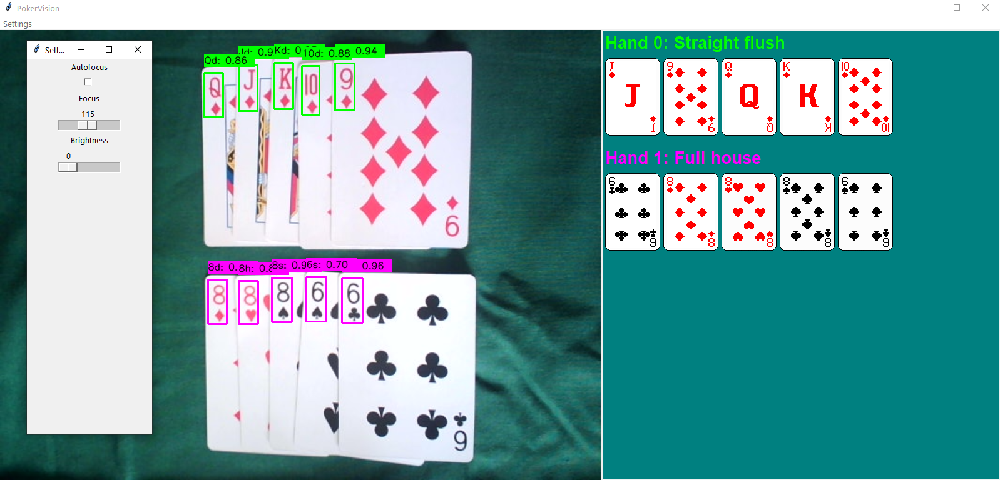
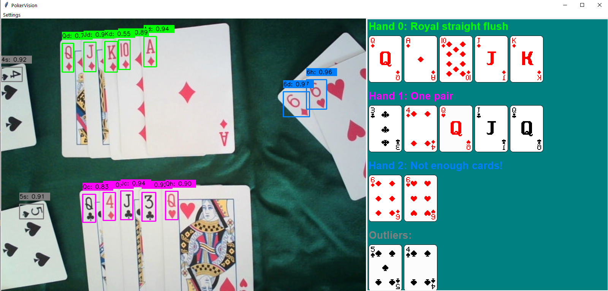

# pokervision

The initial aim of this project is to create an app that takes in a video feed from a webcam, detects playing cards in the frame using machine learning, and organises them into hands, which it identifies the value of.

What I've achieved so far:

* Built a tkinter app to house my project
* Created wrapper for opencv camera which is used to adjust the settings (these are temperamental at the moment!)
* Object detection with YOLO model, with trained weights from [here](https://github.com/PD-Mera/Playing-Cards-Detection)
* Annotated the cards in the frame
* Used DBSCAN clustering to identify hands by proximity
* Identified hand values using the [pokerkit](https://github.com/uoftcprg/pokerkit) package
* Use card sprites to show the hands visually on a separate display

Some examples of the app in action are shown below:

## Dependencies

Dependencies are included in pyproject.toml and poetry.lock. After cloning, run the following to install dependencies:

``poetry install``

## Running the project

In order to start the program, run:

``python .\src\main.py``